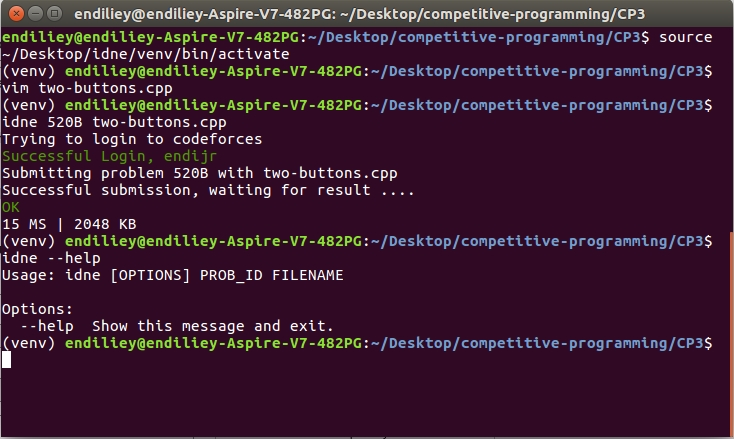
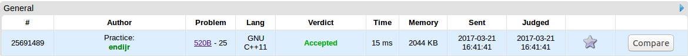

# idne (beta v1.0)
My personal command line utility tool (mainly for Codeforces and personal stuff)

## Current Features:
* Submit solution to Codeforces through command-line (without going to www.codeforces.com/problem/submit/) and get result (OK/ Wrong Answer)



Proof of Working:


## One time setup (pre-installation)

Go to utils/config.py, then insert your username and password
```python
username = "ababcba" # your codeforces username
password = "asdadas" # your password
```


## Installation (For Linux user only)

Prerequisites
-------------

I will assume that you have

* Git
* Python 2.7

Clone the repositories

```
git clone https://github.com/endiliey/idne.git
```

Set-up a Virtualenv
----------

```
pip install virtualenv
```

Create an isolated environments through virtualenv

```
cd idne
virtualenv venv
```

Activate virtualenv
```
. venv/bin/activate
```

Install all required dependencies by typing
```
pip install --editable .
```

Start on using the cli ! you can type this to know how to use it
```
idne --help
```
